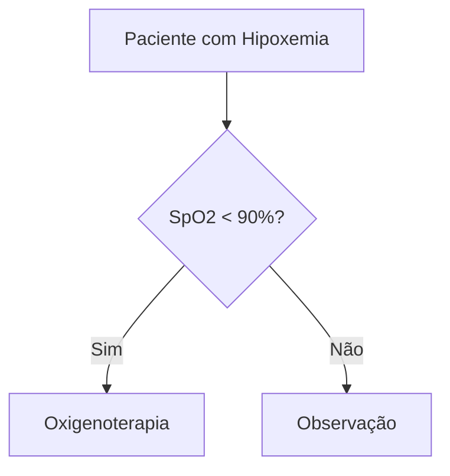

# Notebooks - Conteúdo Interativo

## 📓 Sobre os Notebooks

Esta pasta contém **Jupyter Notebooks interativos** para cada um dos 100 temas de UTI. Cada notebook é uma ferramenta completa de aprendizado que combina teoria, prática e recursos de memorização.

## 📚 Notebooks Disponíveis

### ✅ Completos
1. `01_monitorizacao_hemodinamica_invasiva.ipynb` - Monitorização Hemodinâmica Invasiva
2. `02_monitorizacao_hemodinamica_nao_invasiva.ipynb` - Monitorização Hemodinâmica Não Invasiva
3. `03_cateter_arteria_pulmonar.ipynb` - Cateter de Artéria Pulmonar (Swan-Ganz)
4. `20_sdra.ipynb` - Síndrome do Desconforto Respiratório Agudo (SDRA)
5. `21_casos_integrados_choque_sdra.ipynb` - Casos integrados com checkpoints de Monitorização, SDRA e Choque Séptico

### 🚧 Em Desenvolvimento
Os demais 95 notebooks seguirão a mesma estrutura e serão adicionados progressivamente. Contribuições são bem-vindas!

## 🎯 O que Cada Notebook Contém

1. **📖 Teoria Completa**
   - Conceitos fundamentais
   - Fisiopatologia
   - Quadro clínico
   - Diagnóstico e tratamento

2. **📊 Diagramas e Visualizações**
   - Flowcharts de decisão (Mermaid)
   - Mind maps conceituais
   - Tabelas comparativas
   - Gráficos interativos

3. **🧮 Código Executável**
   - Calculadoras médicas
   - Simuladores de parâmetros
   - Análise de dados
   - Interpretação de resultados

4. **🎮 Ferramentas Interativas**
   - Widgets para ajuste de parâmetros
   - Simuladores de resposta clínica
   - Visualizações dinâmicas
   - Cenários práticos

5. **💡 Flashcards Integrados**
   - Conceitos-chave
   - Revisão rápida
   - Auto-avaliação

6. **❓ Exercícios Práticos**
   - Casos clínicos
   - Questões de múltipla escolha
   - Cálculos práticos
   - Gabaritos explicados

7. **📚 Referências**
   - Guidelines internacionais
   - Artigos científicos
   - Livros-texto
   - Protocolos atualizados

## 🚀 Como Usar

### Primeira Vez

```bash
# 1. Navegue até a pasta do projeto
cd /caminho/para/UTI

# 2. Instale as dependências (se ainda não fez)
pip install -r requirements.txt

# 3. Inicie o Jupyter Notebook
jupyter notebook

# 4. No navegador, acesse a pasta notebooks/
# 5. Clique no notebook desejado para abrir
```

### Executando o Notebook

1. **Leia o conteúdo** sequencialmente
2. **Execute as células** com código (Shift + Enter)
3. **Interaja** com os widgets e simuladores
4. **Modifique parâmetros** para experimentar
5. **Resolva os exercícios** ao final
6. **Salve suas anotações** (File > Save)

### Atalhos Úteis

- `Shift + Enter`: Executar célula e avançar
- `Ctrl + Enter`: Executar célula e permanecer
- `A`: Inserir célula acima
- `B`: Inserir célula abaixo
- `M`: Converter para Markdown
- `Y`: Converter para código
- `D + D`: Deletar célula

## 💡 Dicas de Estudo

### Primeira Leitura
- Execute todas as células sequencialmente
- Não pule código, observe os resultados
- Anote dúvidas para revisar depois

### Segunda Leitura
- Modifique parâmetros nos simuladores
- Teste cenários diferentes
- Tente prever resultados antes de executar

### Revisão
- Foque em flashcards e exercícios
- Refaça cálculos sem consultar
- Compare com suas anotações anteriores

## 🎨 Recursos Visuais

### Mermaid Diagrams

Os notebooks usam diagramas Mermaid para:
- Fluxogramas de decisão clínica
- Mind maps de conceitos
- Sequências temporais
- Relacionamentos entre entidades

**Exemplo:**


### Gráficos Interativos

Visualizações criadas com:
- **Matplotlib**: Gráficos estáticos de alta qualidade
- **Plotly**: Gráficos interativos com zoom e pan
- **Seaborn**: Visualizações estatísticas elegantes

### Widgets Interativos

Controles para ajustar parâmetros em tempo real:
- Sliders para valores numéricos
- Dropdowns para seleção de opções
- Checkboxes para ativar/desativar features
- Botões para ações específicas

## 🔧 Troubleshooting

### Erro: "Módulo não encontrado"
```bash
# Instale as dependências
pip install -r requirements.txt
```

### Kernel desconectado
```
Kernel > Restart
# Em seguida, execute as células novamente do início
```

### Widgets não aparecem
```bash
# Instale extensões do Jupyter
pip install ipywidgets
jupyter nbextension enable --py widgetsnbextension
```

### Diagramas Mermaid não renderizam
Os diagramas Mermaid são renderizados nativamente no GitHub e em alguns visualizadores. Se não aparecerem localmente, o conteúdo ainda estará descrito em texto.

## 📱 Acesso Mobile

### Opções para celular/tablet:

**Android:**
- **Carnets**: App dedicado para Jupyter
- **Termux + Jupyter**: Terminal Linux no Android

**iOS:**
- **Carnets**: Versão iOS
- **Juno**: Cliente Jupyter para iPad

## 🤝 Contribuindo

### Criando Novos Notebooks

Ao criar um novo notebook, siga a estrutura padrão:

```python
# 1. Título e objetivos
# 2. Conceitos fundamentais
# 3. Diagramas e tabelas
# 4. Código interativo
# 5. Casos clínicos
# 6. Flashcards
# 7. Exercícios
# 8. Referências
```

### Template Básico

Use os notebooks existentes (01 e 20) como template. Eles demonstram:
- Estrutura ideal
- Estilo de código
- Formatação Markdown
- Uso de visualizações

## 📊 Progresso

- **Total de temas**: 100
- **Completos**: 2
- **Em desenvolvimento**: 98
- **Meta**: 100% até 2026

## 📞 Suporte

Dúvidas sobre notebooks?
- Abra uma Issue no GitHub
- Marque com tag `notebooks`
- Descreva o problema detalhadamente

---

**Bons estudos! 🎓**
