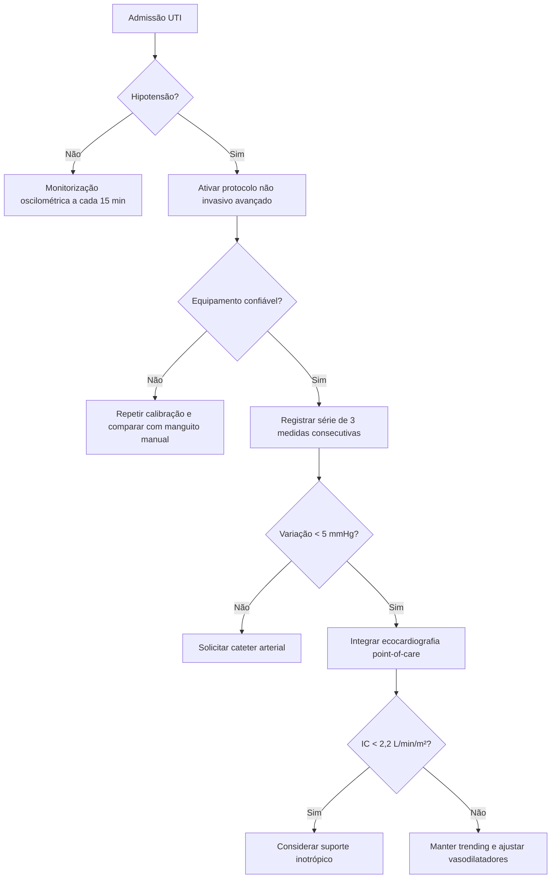

# Algoritmo de Monitorização Não Invasiva

```mermaid
graph TD
    A[Admissão UTI] --> B{Hipotensão?}
    B -- Não --> C[Monitorização oscilométrica a cada 15 min]
    B -- Sim --> D[Ativar protocolo não invasivo avançado]
    D --> E{Equipamento confiável?}
    E -- Não --> F[Repetir calibração e comparar com manguito manual]
    E -- Sim --> G[Registrar série de 3 medidas consecutivas]
    G --> H{Variação < 5 mmHg?}
    H -- Não --> I[Solicitar cateter arterial]
    H -- Sim --> J[Integrar ecocardiografia point-of-care]
    J --> K{IC < 2,2 L/min/m²?}
    K -- Sim --> L[Considerar suporte inotrópico]
    K -- Não --> M[Manter trending e ajustar vasodilatadores]
```
